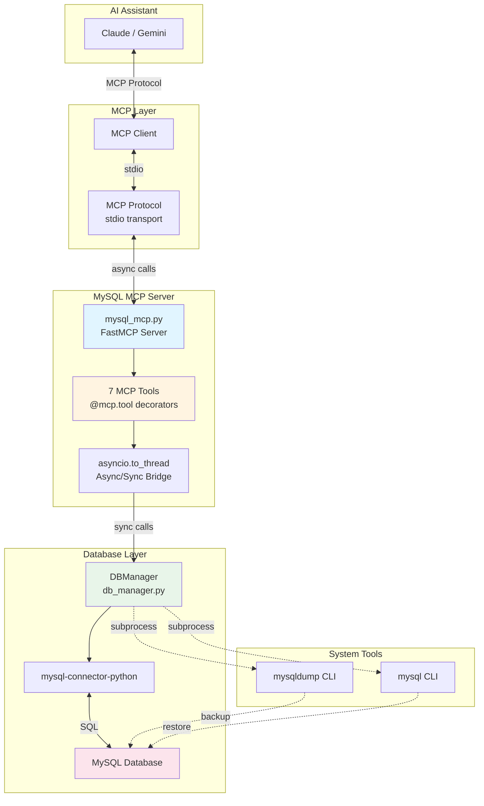
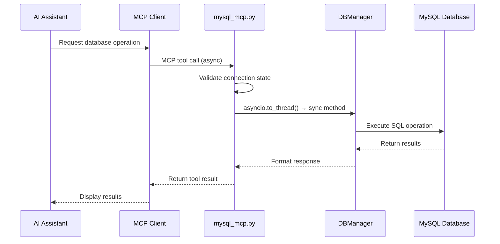
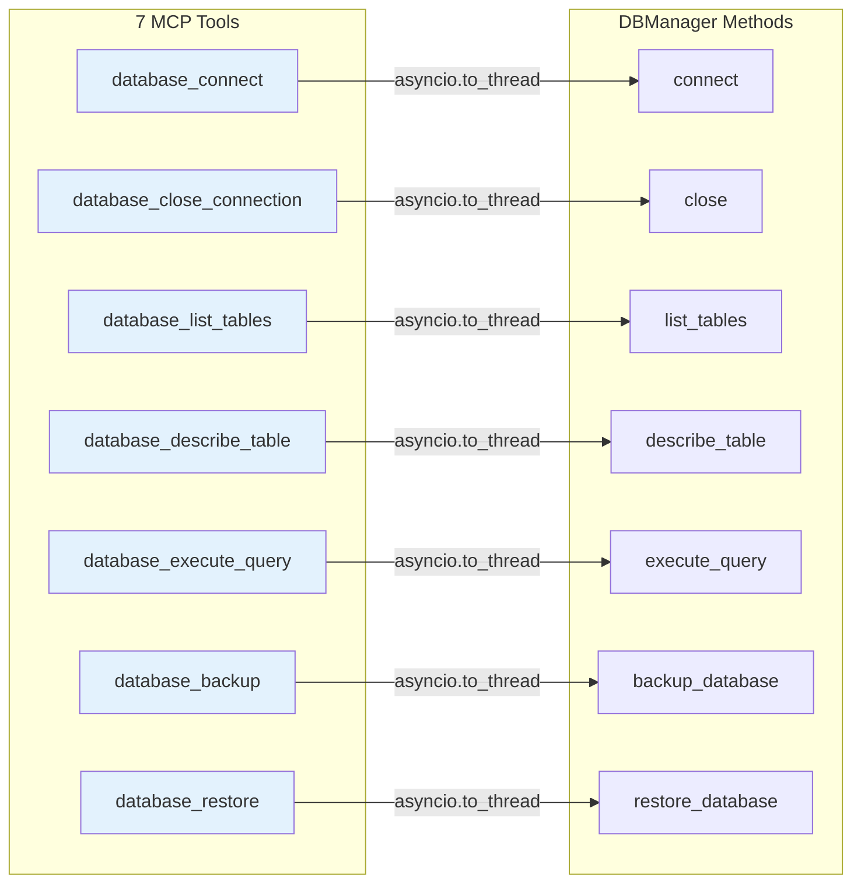

# MySQL MCP Server

> **Model Context Protocol (MCP) server for MySQL database management**

A powerful Python-based MCP server that exposes MySQL database operations as tools for AI assistants like Claude and Gemini. Built with FastMCP and mysql-connector-python.

## Features

- **Database Connection Management**: Connect to any MySQL database with credential management
- **Schema Exploration**: List tables and describe table structures
- **Query Execution**: Execute any SQL query (SELECT, INSERT, UPDATE, DELETE, CREATE, etc.)
- **Backup & Restore**: Create and restore database backups using mysqldump
- **Async/Sync Bridge**: Seamlessly bridges async MCP interface with synchronous MySQL operations
- **Error Handling**: Comprehensive error handling with informative messages
- **Security**: Safe subprocess execution and input validation

## Architecture

### System Architecture Diagram



### Component Interaction Flow



### MCP Tools Architecture



## Requirements

- **Python**: 3.8 or higher
- **MySQL Server**: Any version compatible with mysql-connector-python
- **System Tools** (for backup/restore):
  - `mysqldump` - MySQL backup utility
  - `mysql` - MySQL command-line client

## Installation

### 1. Clone the Repository

```bash
git clone https://github.com/rhayalcantara/proyectos.git
cd proyectos
```

### 2. Install Python Dependencies

```bash
pip install -r mysql_cli_agent/requirements.txt
```

The `requirements.txt` includes:
- `mysql-connector-python` - MySQL database connector
- `pytest` - Testing framework
- `mcp[cli]` - FastMCP framework

### 3. Verify System Tools

Ensure `mysqldump` and `mysql` are available:

```bash
which mysqldump
which mysql
```

## Configuration

### Claude Desktop Configuration

Add to your Claude Desktop configuration file:

**macOS**: `~/Library/Application Support/Claude/claude_desktop_config.json`

**Windows**: `%APPDATA%\Claude\claude_desktop_config.json`

**Linux**: `~/.config/Claude/claude_desktop_config.json`

```json
{
  "mcpServers": {
    "mysql_agent": {
      "command": "python3",
      "args": [
        "/absolute/path/to/proyectos/mysql_cli_agent/mysql_mcp.py"
      ]
    }
  }
}
```

### Gemini Configuration

Add to `.gemini/settings.json` (example included in repository):

```json
{
  "mcpServers": {
    "mysql_agent": {
      "command": "/path/to/python3",
      "args": [
        "/absolute/path/to/proyectos/mysql_cli_agent/mysql_mcp.py"
      ]
    }
  }
}
```

### Generic MCP Client Configuration

For any MCP-compatible client:

```json
{
  "mcpServers": {
    "mysql_agent": {
      "command": "python3",
      "args": ["/absolute/path/to/mysql_cli_agent/mysql_mcp.py"],
      "env": {}
    }
  }
}
```

**Note**: Replace `/absolute/path/to/` with the actual path to your installation.

## Usage

### Starting the Server Manually

For testing or development:

```bash
python mysql_cli_agent/mysql_mcp.py
```

The server runs with stdio transport and communicates via standard input/output.

### Using with AI Assistants

Once configured, interact with your AI assistant naturally:

```
"Connect to my MySQL database at localhost with user root"
"Show me all the tables in the database"
"Describe the structure of the users table"
"Run this query: SELECT * FROM users WHERE active = 1"
"Create a backup of the database to backup.sql"
```

## Available MCP Tools

### 1. `database_connect`

Connect to a MySQL database.

**Parameters:**
- `host` (str): Database host
- `user` (str): Database user
- `password` (str): User password
- `database` (str): Database name
- `port` (int, optional): Port number (default: 3306)

**Returns:**
```json
{"success": true, "message": "Conexión exitosa."}
```

### 2. `database_close_connection`

Close the current database connection.

**Returns:**
```json
{"status": "Conexión cerrada exitosamente."}
```

### 3. `database_list_tables`

List all tables in the current database.

**Returns:**
```json
["users", "products", "orders"]
```

### 4. `database_describe_table`

Get the structure of a specific table.

**Parameters:**
- `table_name` (str): Name of the table

**Returns:**
```json
[
  {
    "Field": "id",
    "Type": "int(11)",
    "Null": "NO",
    "Key": "PRI",
    "Default": null,
    "Extra": "auto_increment"
  },
  ...
]
```

### 5. `database_execute_query`

Execute any SQL query.

**Parameters:**
- `query` (str): SQL query to execute

**Returns (SELECT):**
```json
{
  "headers": ["id", "name", "email"],
  "rows": [
    [1, "John Doe", "john@example.com"],
    [2, "Jane Smith", "jane@example.com"]
  ]
}
```

**Returns (INSERT/UPDATE/DELETE):**
```json
{"rows_affected": 5}
```

### 6. `database_backup`

Create a database backup using mysqldump.

**Parameters:**
- `output_file` (str): Path to save the backup file

**Returns:**
```json
{
  "success": true,
  "message": "Backup creado exitosamente en backup.sql"
}
```

### 7. `database_restore`

Restore a database from a backup file.

**Parameters:**
- `input_file` (str): Path to the backup file

**Returns:**
```json
{
  "success": true,
  "message": "Restauración desde backup.sql completada exitosamente."
}
```

**⚠️ WARNING**: This operation is destructive and will overwrite existing data.

## Testing

### Run All Tests

```bash
pytest mysql_cli_agent/tests/
```

### Run with Verbose Output

```bash
pytest mysql_cli_agent/tests/ -v
```

### Run Specific Test File

```bash
pytest mysql_cli_agent/tests/test_db_manager.py
```

### Run Specific Test

```bash
pytest mysql_cli_agent/tests/test_db_manager.py::TestDBManager::test_execute_query_select_success
```

### Test Coverage

The test suite includes:
- Connection management tests
- Table listing and description tests
- Query execution tests (SELECT, INSERT)
- Error handling tests
- Backup/restore operation tests
- Transaction control tests (commit/rollback)

All tests use mocks and require no actual MySQL database.

## Project Structure

```
proyectos/
├── mysql_cli_agent/
│   ├── src/
│   │   ├── __init__.py
│   │   └── db_manager.py          # Core DBManager class (206 lines)
│   ├── tests/
│   │   ├── __init__.py
│   │   └── test_db_manager.py     # Unit tests (201 lines)
│   ├── mysql_mcp.py               # MCP server entry point (78 lines)
│   ├── requirements.txt           # Python dependencies
│   ├── PLAN.md                    # Original development plan
│   └── PLAN_RECTIFICATIVO.md      # MCP migration plan
├── .gemini/
│   └── settings.json              # Gemini MCP configuration
├── CLAUDE.md                      # Claude Code guidance
└── README.md                      # This file
```

## Key Design Patterns

### Single Connection Management

The server maintains **only one active database connection** at a time:

- Must close current connection before connecting to another database
- Connection state validated before each operation
- Connection config stored for backup/restore operations

### Async/Sync Bridge

MCP tools are async, but `DBManager` methods are synchronous:

```python
# In mysql_mcp.py
await asyncio.to_thread(db_manager.method, *args)
```

This pattern allows synchronous database operations to work seamlessly with the async MCP interface.

### Error Handling

- **Connection errors**: Specific handling for access denied and database not found
- **Query errors**: Automatic transaction rollback on SQL errors
- **Validation**: Table existence checked before operations
- **Subprocess errors**: Checks for missing system tools

### Response Normalization

Consistent response formats across all tools:

- Success operations: `{"success": bool, "message": str}`
- Query results: `{"headers": [...], "rows": [...]}`
- DML operations: `{"rows_affected": int}`
- Errors: `{"error": str}`

## Security Considerations

- **Subprocess Safety**: Commands constructed as lists to prevent injection
- **Input Validation**: Table names validated before use in queries
- **Password Visibility**: Passwords visible in process list during subprocess calls
- **File Validation**: Backup files validated before restore operations
- **Single Session**: One connection per server instance

## Troubleshooting

### mysqldump/mysql not found

Ensure MySQL client tools are installed and in your PATH:

```bash
# macOS (via Homebrew)
brew install mysql-client
export PATH="/usr/local/opt/mysql-client/bin:$PATH"

# Ubuntu/Debian
sudo apt-get install mysql-client

# CentOS/RHEL
sudo yum install mysql
```

### Connection Refused

Verify MySQL server is running and accessible:

```bash
mysql -h localhost -u root -p
```

### Permission Denied

Ensure the user has appropriate database privileges:

```sql
GRANT ALL PRIVILEGES ON database_name.* TO 'user'@'host';
FLUSH PRIVILEGES;
```

## Development

### Code Language

Note that the codebase uses **Spanish** for:
- Variable names
- Comments
- Docstrings
- Error messages

### Contributing

1. Fork the repository
2. Create a feature branch
3. Make your changes
4. Run tests: `pytest mysql_cli_agent/tests/`
5. Submit a pull request

## Recent Changes

**v1.0** - MCP Migration (Sep 2025)
- Migrated from planned FastAPI architecture to FastMCP
- Implemented 7 MCP tools for database operations
- Added comprehensive test suite
- Created async/sync bridge pattern

## License

[Include your license here]

## Support

For issues, questions, or contributions:
- Create an issue on GitHub
- Review CLAUDE.md for development guidance
- Check test files for usage examples

## Acknowledgments

- Built with [FastMCP](https://github.com/jlowin/fastmcp)
- Uses [mysql-connector-python](https://dev.mysql.com/doc/connector-python/en/)
- Compatible with [Model Context Protocol](https://modelcontextprotocol.io/)
